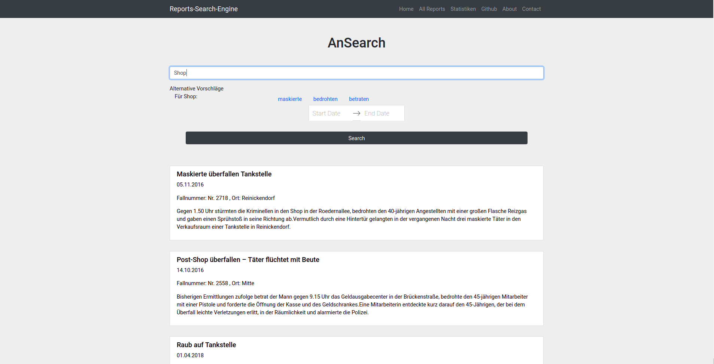
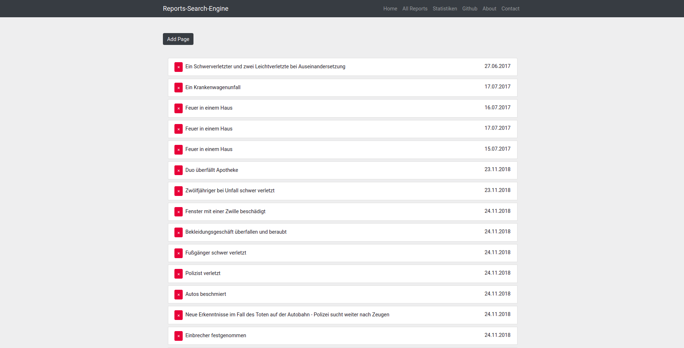

# AnSearch

Search-engine: webapp build with MERN-Stack backed with TF-IDF / Levenshtein-algorithm implemented in python.

## Learned
- VS code
- NoSQL-Databases
  - mongodb with mongo-cli
  - redis with redis-cli
- mongoose / pymongo
- node.js
- express
- react.js
- redux: Statemanager
- zeromq, in particular zerorpc for RP-Calls
- anaconda


## Prerequisites
- Data [maybe stored in Mongo]
  - we crawled the data from: 
- Dataformat (since we will store and search police-articles) with JSON - fields:
  - id
  - date
  - title
  - location
  - text
  - number (related id(-s) of the article)

## Setup

1. Download Repository and switch to root folder
2. Create Raw-Data-Collection in Mongo:
   - open ./GetDataFromDatabase/push_data_to_another_db.ipynb
   - adjust database-name (all collections have to be in same database)
   - run script
3. Create Work-Data-Collection in Mongo:
   - open ./GetDataFromDatabase/create_work_data.ipynb
   - adjust database-name (all collections have to be in same database)
   - run script	
4. Create Inverse-Index in Mongo:
   - open ./reverseindex/reverse_index.py
   - adjust database-name
   - run
5. Adjust DB- and Collection-name in Main-RPC-Server
   - open ./accessPythonFromNodeJ/GetSearchResultsRPC.py
   - adjust DB-name and Collection-name (all collections have to be in same database)
6. Run App
   - run python-rpc server:
      - python ./accessPythonFromNodeJ/GetSearchResultsRPC.py
   - run wep-app:
      - cd ./WebApp
      - sudo npm run dev


## TL;DR:
### Current default-values
 - db: mongodb
 - server: "localhost"
 - port: "27017"
 - DB Raw-data: db_from_which_the_raw_data_comes: "crawlerdb_BACKUP"
 - collection Raw-Data: collection_in_db_from_which_the_raw_data_comes: "crawlerdb"
 - DB we work and search in: crawlerdb_WORK_TFIDF_3
 - collection-name of unprocessed data in DB we work in: raw_collection_in_database: "crawlerdb"
 - collection-name of processed data in db we work in: work_data_collection_in_database: "lower_without_punctuation_with_SW"
 - collection-name of inverse-index in db we work in: inverse_index_collection_in_database: "crawlerdb_INVERSE_INDEX"

### Setup to test python backend
 - in simplest way you only need to work with WorkNotebookForGetSearch.ipynb (here you don't search properly. Instead you load a couple of documents out of mongo)
   - open, adjust, work and test with only ./accessPythonFromNodeJ/WorkNotebookForGetSearch.ipynb
   - ```data``` has same type as "normal" - search-result-output
 - if you need the 'real' search-module, you have to ensure that step 1,2,3,4 is done. Then you can comment out the related lines in the notebook and update the DB-name and so on
   - open ./accessPythonFromNodeJ/WorkNotebookForGetSearch.ipynb
   - uncomment ```#search = Search(DBMongo)``` and ```#data = search.get_search_results(searchString)``` and comment out ```data = list(collectionMongo.find({}).limit(5))```

### Preview





## Build with

* npm - Packagemanager
* anaconda - jupyter lab

## Acknoledgements

* Nice Introduction to MERN-Stack: [Traversy Media - Youtube](https://www.youtube.com/user/TechGuyWeb)
